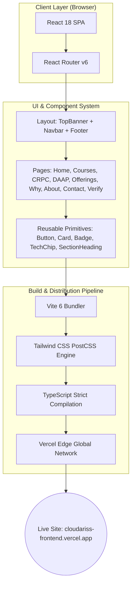

<div align="center">

# ⚡ Cloudariss Technologies

### Modern Technology, Cloud, Data & AI Learning Ecosystem
**Learn. Build. Get Hired.**

[](https://cloudariss-frontend.vercel.app)
[](https://github.com/saketh752/cloudariss-frontend)

<br/>

[](https://reactjs.org/)
[](https://www.typescriptlang.org/)
[](https://tailwindcss.com/)
[](https://vitejs.dev/)
[](https://cloudariss-frontend.vercel.app)
[](LICENSE)

<br/>

[🌐 Explore Live Website](https://cloudariss-frontend.vercel.app) • [📚 View Programs](#-programs-breakdown) • [🛠️ Tech Stack](#️-technology-stack) • [🚀 Quick Start](#-getting-started) • [📞 Contact Us](#-official-channels)

</div>

---

## 📌 Table of Contents

- [Overview](#-overview)
- [Live Site Architecture & Routes](#-site-architecture--routes)
- [Programs Breakdown](#-programs-breakdown)
  - [CRPC (Cloud & Data Track)](#crpc--cloud-ready-professional-curriculum)
  - [DAAP (Data Analytics & AI Track)](#daap--data-analytics-accelerator-program)
- [Key Architectural Highlights](#-key-architectural-highlights)
- [Design System & Palette](#-design-system--tokens)
- [Architecture & Data Flow](#-system-architecture)
- [Getting Started](#-getting-started)
- [Official Channels](#-official-channels)

---

## 💡 Overview

**Cloudariss Technologies** is a modern, high-performance web platform built to showcase industry-grade career accelerator programs in **Cloud Computing, Data Engineering, Analytics, and Automation**. 

Grounded in **Visakhapatnam (Vizag)** with an enterprise-ready curriculum, Cloudariss pairs deep technical foundations with virtual company simulations, realistic end-to-end projects, and dedicated career preparation.

> [!IMPORTANT]  
> **Truthful & Grounded V1**: Built without inflated salary statistics, fake student counts, unverified company placements, or artificial guarantees. Every section represents real capabilities and rigorous structured learning.

---

## 🗺️ Site Architecture & Routes

Explore the 9 fully interactive pages and custom 404 fallback:

| Route | Page | Purpose & Interactive Features |
| :--- | :--- | :--- |
| [`/`](https://cloudariss-frontend.vercel.app/) | **Home** | 11-section narrative, interactive hero visual, offer cards, dynamic project tabs, journey timeline |
| [`/courses`](https://cloudariss-frontend.vercel.app/courses) | **Programs Overview** | Side-by-side comparative analysis of CRPC vs. DAAP, shared 5-stage progression |
| [`/courses/crpc`](https://cloudariss-frontend.vercel.app/courses/crpc) | **CRPC Deep Dive** | 5 core tech pillars, 6-stage engineering roadmap, 4 enterprise projects, `#curriculum` scroll |
| [`/courses/daap`](https://cloudariss-frontend.vercel.app/courses/daap) | **DAAP Deep Dive** | 6 data/AI building blocks, 6-stage sprint roadmap, 6 projects + Enterprise Capstone |
| [`/offerings`](https://cloudariss-frontend.vercel.app/offerings) | **Offerings** | Ecosystem breakdown: Technical Learning, Hands-on Projects, Modern Stack, Career Prep |
| [`/why-cloudariss`](https://cloudariss-frontend.vercel.app/why-cloudariss) | **Why Cloudariss** | 6 Core Differentiators, CRPC vs DAAP specialization matrix, Tech Stack breakdown |
| [`/about`](https://cloudariss-frontend.vercel.app/about) | **About Us** | Vizag-grounded identity, 4 core organizational pillars, 7 specialized focus areas |
| [`/contact`](https://cloudariss-frontend.vercel.app/contact) | **Contact & Inquiries** | Interactive inquiry form, verified phone numbers, direct WhatsApp, and social channels |
| [`/verify-certificate`](https://cloudariss-frontend.vercel.app/verify-certificate) | **Verify Certificate** | Certificate ID validation interface, direct WhatsApp verification link, trust markers |
| `/*` | **404 Fallback** | Branded page-not-found route with quick-action same-tab return to Home |

---

## 🎓 Programs Breakdown

<details>
<summary><b>🔹 CRPC — Cloud Ready Professional Curriculum (Click to expand)</b></summary>
<br/>

Designed for engineers looking to master production cloud environments, data pipelines, and infrastructure as code.

### 5 Technology Pillars
1. **Linux & Infrastructure Fundamentals**: File systems, system administration, networking, bash scripting.
2. **Cloud Architecture & Engineering**: AWS core services (EC2, S3, IAM, VPC, CloudWatch), high availability.
3. **Containerization & Orchestration**: Docker packaging, multi-container compose, Kubernetes clustering.
4. **CI/CD & DevOps Automation**: GitHub Actions, automated test suites, artifact management.
5. **Data Pipelines & Storage**: SQL, database migrations, ETL concepts, managed data services.

### 4 Flagship Projects
- 🚀 **Multi-Tier Web App on AWS**: High-availability VPC architecture with auto-scaling and ALB.
- 📦 **Docker Microservices Deployment**: Containerized multi-service app with isolated network bridges.
- 🔄 **Automated CI/CD Pipeline**: GitHub Actions pipeline testing and deploying containers to cloud registry.
- 📊 **Cloud-Native Data Ingestion Engine**: Automated pipeline ingesting, cleaning, and storing operational data.

</details>

<details>
<summary><b>🔹 DAAP — Data Analytics Accelerator Program (Click to expand)</b></summary>
<br/>

Designed for analytical minds wanting to transform raw transactional data into actionable business intelligence with AI.

### 6 Building Blocks
1. **Spreadsheets & Analytical Thinking**: Advanced Excel/Sheets, data modeling, nested formulas, pivot tables.
2. **Relational Databases & SQL Mastery**: Complex joins, window functions, CTEs, indexing, aggregation.
3. **Data Visualization & BI Dashboards**: Power BI / Tableau dashboards, KPI cards, drill-downs.
4. **Python for Data Science**: Pandas, NumPy, statistical data cleaning, exploratory data analysis (EDA).
5. **Applied Machine Learning & Predictive Modeling**: Regression, classification, customer segmentation.
6. **Modern AI-Powered Analytics**: Generative AI workflows, automated report generation, LLM data assistants.

### 6 Production Projects + 1 Capstone
- 🛒 **E-Commerce Sales & Revenue Dashboard**: Interactive BI dashboard tracking GMV and cohort retention.
- 💳 **Banking Customer Churn Predictor**: Machine learning model identifying at-risk customer accounts.
- 🏭 **Supply Chain Inventory Optimizer**: SQL pipeline analyzing stock velocity and supplier bottlenecks.
- 🏥 **Healthcare Operations Analyzer**: Patient length-of-stay analysis with interactive dashboarding.
- 📈 **Financial Risk & Credit Scoring Engine**: Multivariate regression scoring model for loan underwriting.
- 🤖 **AI Customer Sentiment & Review Analyzer**: NLP classification pipeline analyzing qualitative feedback.
- 🏆 **Enterprise Capstone Project**: Complete end-to-end data pipeline from raw ingestion to executive dashboard.

</details>

---

## 🎨 Design System & Tokens

Cloudariss employs a custom dark-mode-first aesthetic inspired by cloud terminal interfaces and modern enterprise SaaS:

| Color Name | Hex Code | Preview | Usage |
| :--- | :--- | :---: | :--- |
| **Brand Navy** | `#071B63` | `` | Primary brand dark background and surface tints |
| **Brand Blue** | `#0878E8` | `` | Primary interactive buttons, focus states, links |
| **Brand Cyan** | `#19BCE8` | `` | Badges, gradient accents, highlights, tech tags |
| **Brand Orange** | `#FF7A00` | `` | Limited-time promotional offers, urgency badges |
| **Dark Base** | `#060C1E` | `` | Deep page canvas background |
| **Dark Card** | `#0D1630` | `` | Card surfaces with subtle border strokes |

- **Typography**: `Manrope` (Headings & Display), `Inter` (Body & Code).

---

## 🏗️ System Architecture



---

## ⚡ Key Architectural Highlights

- **⚡ Blazing Fast Build**: Compiles 1,600+ modules in ~24s using Vite 6 with esbuild.
- **📄 Interactive Curriculum PDF Viewer**: Direct in-app PDF preview modal and download actions for both official program syllabi (`CRPC_CloudData_3Month_Schedule_ONLINE_Updated.pdf` and `DAAP_GenAI_Agentic_Original_Structure_With_Cloudariss_Logo.pdf`).
- **🎨 Authentic Visual Assets**: 13 authentic brochure assets integrated across Hero, Programs, Offerings, and About pages.
- **✨ Official SVG Tech Ecosystem**: Pixel-perfect vector brand icons for AWS, Docker, Kubernetes, Jenkins, GitHub, Grafana, ServiceNow, Python, SQL, Power BI, ChatGPT, Claude, Gemini, LangChain, RAG, and Agentic AI.
- **🗺️ Interactive 5-Stage Journey**: Visual step-by-step learning progression (`LEARN → PRACTICE → BUILD → PREPARE → GET HIRED`) with interactive node selection.
- **📱 Fully Responsive**: Custom layout breakpoints validated from 320px mobile screens up to 4K ultra-wide monitors.
- **♿ Accessible (a11y)**: Built-in `prefers-reduced-motion` fallbacks, high-contrast text ratios, and custom `:focus-visible` outlines.
- **🔍 Route-Aware Dynamic SEO**: Instant dynamic `document.title` and `meta[description]` updates on page transitions.
- **🔄 SPA Rewrites on Vercel**: `vercel.json` configures seamless reload capability for deep paths (`/courses/crpc`, `/verify-certificate`, etc.).
- **🔒 Type Safety**: 100% strict TypeScript (`strict: true`, `noUnusedLocals: true`).

---

## 🚀 Getting Started

### Prerequisites
- **Node.js**: v18.0.0 or later (v20+ recommended)
- **npm**: v9.0.0 or later

### 1. Clone the Repository
```bash
git clone https://github.com/saketh752/cloudariss-frontend.git
cd cloudariss-frontend
```

### 2. Install Dependencies
```bash
npm install
```

### 3. Start Development Server
```bash
npm run dev
```
Open [http://localhost:5173](http://localhost:5173) in your browser.

### 4. Build for Production
```bash
npm run build
```

### 5. Local Production Preview
```bash
npm run preview
```

---

## 📞 Official Channels

Connect directly with the Cloudariss team:

- 📱 **Official Phone**: [+91 90593 34622](tel:+919059334622) / [+91 63026 80457](tel:+916302680457)
- 💬 **WhatsApp Us**: [](https://wa.me/916302680457)
- 📸 **Instagram**: [](https://www.instagram.com/cloudariss.tech/?hl=en)
- 💼 **LinkedIn**: [](https://www.linkedin.com/company/cloudariss-technologies/posts/?feedView=all)
- 📍 **Headquarters**: Visakhapatnam (Vizag), Andhra Pradesh, India

---

<div align="center">
  <sub>Built with ❤️ for <b>Cloudariss Technologies</b> • Empowering careers with Cloud, Data & Automation skills.</sub>
</div>

